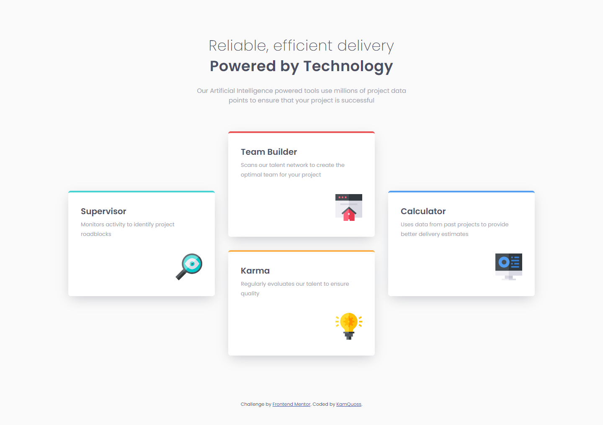
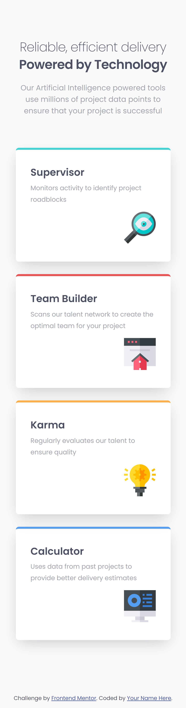

# Frontend Mentor - Four card feature section solution

This is a solution to the [Four card feature section challenge on Frontend Mentor](https://www.frontendmentor.io/challenges/four-card-feature-section-weK1eFYK). Frontend Mentor challenges help you improve your coding skills by building realistic projects. 

## Table of contents

- [Overview](#overview)
  - [The challenge](#the-challenge)
  - [Screenshot](#screenshot)
  - [Links](#links)
- [My process](#my-process)
  - [Built with](#built-with)
  - [What I learned](#what-i-learned)
  - [Continued development](#continued-development)
  - [Useful resources](#useful-resources)
- [Author](#author)

## Overview

### The challenge

Users should be able to:

- View the optimal layout for the site depending on their device's screen size

### Screenshot
Desktop

Mobile

### Links

- Solution URL: [here](https://kamquoss.github.io/four-card-feature-section-master/)

## My process

### Built with

- Semantic HTML5 markup
- CSS custom properties
- Flexbox
- CSS Grid
- Desktop-first workflow

### What I learned

- media queries
- CSS grid

### Continued development

In future projects I will focus on CSS grid features.

### Useful resources

- [A Complete Guide to Flexbox](https://css-tricks.com/snippets/css/a-guide-to-flexbox/) - Love this one when i forgot something about flex.
- [CSS Grid Basics](https://www.youtube.com/playlist?list=PLbSquHt1VCf0b43dfLKTrCriXdlZcmgoi) - This are really good videos describing CSS grid. 

## Author

- LinkedIn - [Kamila Kłosek](https://www.linkedin.com/in/kamila-k%C5%82osek-b16b08a7/)
- Frontend Mentor - [@KamQuoss](https://www.frontendmentor.io/profile/KamQuoss)